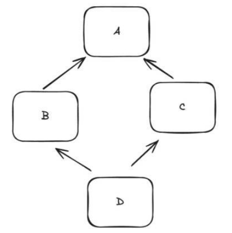

# Java基础面试题

## Java语言有什么特点？

Java是一门面向对象（封装、继承、多态）的编程语言。

Java具有平台无关性和移植性

Java具有稳健性

## Java是如何实现跨平台的？

Java通过JVM（Java虚拟机）来实现跨平台。

## 你认为Java的优势是什么？

我觉得可以从跨平台、垃圾回收、生态、面向对象四个方面来阐述。

- 跨平台：Java是跨平台的，不同平台执行的机器码是不一样的，而Java因为加了一层中间层JVM,所以可以做到一次编写多平台运行。即
  [Write once,Run anywhrer];编译执行过程是先把Java源代码编译成字节码，字节码再由JVM解释或JIT编译执行，而因为JIT编译时
  需要预热的，所以还提供了AOT(Ahead Of Time Complilation) ,可以直接把字节码转成机器码，来让程序重启之后能徐宿拉满战斗力。
  （解释执行比编译执行效率差）
- 垃圾回收：Java还提供了垃圾回收功能，虽说手动管理内存意味着自由、精细化地掌控，但是很容易出错；在内存较充裕的当下，将内存的
  管理交给GC来做，减轻了程序员编程的负担，提升了开发效率，更加划算！
- 生态：现在Java生态圈太全了，丰富的第三方类库、网上全面的资料、企业级框架
- 面向对象：Java是一种严格的面向对象编程语言，具有清晰的的类、对象、继承、接口等概念，支持封装、继承、多态等OOP特性，
  有助于代码的可维护性和可扩展性。

## Java和C++有什么区别？

Java和C++都是面向对象的编程语言，但是它们有以下区别：

- 平台无关性：Java是跨平台的，而C++不是。
- 内存管理：Java有自动垃圾回收机制，而C++需要手动管理内存。

## 为什么Java不支持多继承？

主要是因为多继承会产生菱形继承（也叫钻石继承）问题

