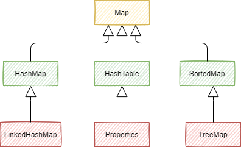

# Java集合面试题

## 集合概述

### 数组到底是不是对象？

先说说对象的概念。对象是根据某个类创建的一个实例，表示某类事物中一个具体的个体。
对象具有各种属性，并且具有一些特定的行为。
站在计算机的角度，对象就是内存中的一个内存块，在这个内存块封装了一些数据，也就是类中定义的各个属性。
所以，对象是用来封装数据的。
java中的数组具有java中其他对象的一些基本特点。比如封装了一些数据，可以访问属性，也可以调用方法。
因此，可以说，数组是对象。
也可以通过代码验证数组是对象的事实。

```java
public class ArrayIsObject {
    public static void main(String[] args) {
        int[] arr = new int[10];
        System.out.println(arr instanceof Object); // true
    }
}
```

### 为什么使用基本类型数组进行Arrays.sort时不能自定义比较器？

Arrays.sort()默认是升序排序，如果要降序排序，需要自定义比较起

Arrays.sort()有多个重载版本，其中针对基本类型数组的版本不接受自定义比较器
具体来说，Arrays.sort有以下几种主要的重载方法

1. `Arrays.sort(int[] a)` : 用于排序`int`数组，按自然顺序排序，不接受比较器
2. `Arrays.sort(T[] a, Comparator<? super T> c)`:用于排序泛型对象数组，按自定义比较起排序

**根本原因**：Comparator 是泛型接口，而泛型不能使用基本类型，因此 Arrays.sort(primitive[], Comparator) 在类型系统层面就不可能存在。

### Comparator和Comparable有什么区别？

Comparator和Comparable都是Java中用于对象排序的接口，它们之间有一下关键的区别。

Comparable接口是在对象自身的类中实现的，它定义了对象的自然排序方式。一个类实现类Comparable接口后，可以使用compareTo方法来比较当前对象和其他对象的大小关系。这个接口只能在对象自身的类中实现，不需要额外的比较器。

Comparator接口是一个独立的比较起，它可以用于对不同类的对象进行排序。Comparator接口允许在对象类之外创建一个单独的比较器或匿名类，并使用它来定义对象的排序规则。比较器通过实现compare()方法来比较两个对象的大小关系。

因此，主要区别如下：

- Comparable接口是在对象自身的类中实现，定义了对象的自然排序方式。
- Comparator接口是一个单独的比较器，定义了用于排序的规则，可以用于不同类的对象排序。
- Comparable是内部排序，对象的类必须实现Comparable接口才能进行排序。
- Comparator是外部排序，可以定义独立的规则，并与任何类的对象一起使用

在使用时，如果需要对对象的默认排序进行操作，可以实现Comparable接口，并重写compareTo()方法。如果需要自定义排序规则，则需要定义一个比较器，并实现Comparator接口，并重写compare()方法。

### Java中的集合框架有哪些核心接口？有什么区别？

Java中的集合提供了一组接口和类，用于存储和操作数据集合。其中一些核心接口包括：

- `Collection`：这是最基本的集合接口，它定义了集合的基本操作，如添加、删除、遍历等。
- `List`：这是继承自Collection的接口，它定义了列表（有序的）操作，如获取索引位置的元素、设置索引位置的元素、获取列表的长度等。
- `Set`：这是继承自Collection的接口，它定义了集合中的元素不重复，即不允许重复元素。
- `Map`：这是继承自Collection的接口，它定义了键值对（键-值）的集合，如获取键对应的值、判断键是否存在、获取键值对个数等。
- `Queue`：这是继承自Collection的接口，它定义了队列操作，如添加元素、移除元素、获取队列长度等。

### 常见的集合有哪些？

Java集合类主要由两个接口Collection和Map派生出来的，Collection有三个子接口List、Set和Queue，而Map有HashMap、LinkedHashMap、TreeMap、Hashtable、Properties等。



### 集合框架底层数据结构总结

#### List

- ArrayList: Object[] 数组
- Vector: Object[] 数组
- LinkedList: 双向链表

#### Queue

- ProrityQueue: Object[] 数组来实现小顶堆
- ArrayDeque: 可扩容动态双向数组
-

#### Set

- HashSet: 无序、唯一，基于HashMap实现，底层采用HashMap存储元素
- LinkedHashSet: 唯一、有序，基于LinkedHashMap实现，底层采用LinkedHashMap存储元素
- TreeSet: 有序、唯一，基于红黑树实现，底层采用红黑树存储元素

#### Map

- HashMap: 基于哈希表实现，键值对存储，不保证有序
- LinkedHashMap: 基于哈希表和链表实现，键值对存储，有序
- TreeMap: 基于红黑树实现，键值对存储，有序
- Hashtable: 基于哈希表实现，键值对存储，不保证有序

#### 并发容器

- CopyOnWriteArrayList: 线程安全的 ArrayList,`CopyOnWriteArrayList`是读写分离的,好处是提高线程访问效率。
- ConcurrentHashMap: 是一个支持高并发更新与查询的哈希表
- ConcurrentLinkedQueue: 线程安全的队列，基于链表实现，FIFO
- BlockingQueue: 阻塞队列，线程安全的队列，支持阻塞操作，如 take()、put()

### 如何选用集合？

主要根据集合的特点来选择合适的集合。

- 如果需要存储唯一的元素，且不要求有序，则使用 HashSet。
- 如果需要存储唯一的元素，且要求有序，则使用 LinkedHashSet。
- 如果需要根据元素的自然顺序排序，则使用 TreeSet。
- 如果需要存储键值对，且不要求有序，则使用 HashMap。
- 如果需要存储键值对，且要求有序，则使用 LinkedHashMap。
- 如果需要根据键的自然顺序排序，则使用 TreeMap。
- 如果需要线程安全的哈希表，则使用 ConcurrentHashMap。
- 如果需要线程安全的队列，则使用 ConcurrentLinkedQueue 或 BlockingQueue。
- 如果需要读写分离的线程安全的列表，则使用 CopyOnWriteArrayList。

## List详解

### ArrayList了解吗？

`ArrayList`的底层是动态数组，它的容量能动态增长。在添加大量元素前，应用可以使用`ensureCapacity`操作增加`ArrayList`实例的容量。ArryList继承了AbstractList类，实现了List接口。

### ArrayList和Array(数组)的区别？

`ArrayList`内部基于动态数组实现，比`Array`(静态数组)使用起来更加灵活：

- `ArrayList`会根据实际存储的元素动态地扩容或缩容，而`Array`被创建之后就不能改变它的长度了。
- `ArrayList`允许使用泛型来确保类型安全，而`Array`则不能。
- `ArrayList`中只能存储对象。对于基本类型数据，需要使用其对于的包装类（如Integer、Double、Character、Boolean等）。`Array`可以直接存储基本数据类型，也可以存储对象。
- `ArrayList`支持插入、删除、遍历等常见操作，并且提供了丰富的API操作方法，比如`add()`、`remove()`等。`Array`只是一个固定长度的数组，只能按照下标访问其中的元素，不具备动态添加、删除元素的能力。
- `ArrayList`创建时不需要指定大小，而`Array`需要在创建时指定大小。

### ArrayList的扩容机制？

ArrayList的扩容本质就是计算出新的扩容数组的size后实例化，并将原有数组内容复制到新数组中去。默认情况下，**新的容量会是原容量的1.5倍** 以JDK1.8为例：

```java
public boolean add(E e) {
    // 1. 检查是否需要扩容
    ensureCapacityInternal(size + 1);  // Increments modCount!!
    // 2. 新增元素
    elementData[size++] = e;
    return true;
}
// 每次在add()一个元素时，arrayList都会检查是否需要扩容，如果需要则调用ensureCapacityInternal()方法
private void ensureCapacityInternal(int minCapacity) {
    ensureExplicitCapacity(calculateCapacity(elementData, minCapacity));
}

private static int calculateCapacity(Object[] elementData, int minCapacity) {
    // 如果传入的是个空数组则最小容量取默认容量与minCapacity之间的最大值
    if (elementData == DEFAULTCAPACITY_EMPTY_ELEMENTDATA) {
        return Math.max(DEFAULT_CAPACITY, minCapacity);
    }
    return minCapacity;
}

private void ensureExplicitCapacity(int minCapacity) {
    modCount++;
    // 若ArrayList已有的存储能力满足最低存储要求，则返回add直接添加元素；如果最低要求的存储能力>ArrayList的存储能力，则扩容
    if (minCapacity - elementData.length > 0)
        grow(minCapacity);
}

private void grow(int minCapacity) { 
    // 获取elementData数组的内存空间长度
    int oldCapacity = elementData.length;
    // 扩容至原来的1.5倍
    int newCapacity = oldCapacity + (oldCapacity >> 1);
    // 检查容量是否足够
    if (newCapacity - minCapacity < 0)
        newCapacity = minCapacity;
    // 若预设值大于默认的最大值，检查是否溢出
    if (newCapacity - MAX_ARRAY_SIZE > 0)
        newCapacity = hugeCapacity(minCapacity);
    // 调用Arrays.copyOf()方法将elementData数组指向新的内存空间
    // 并将原有数组内容复制到新数组中去
    elementData = Arrays.copyOf(elementData, newCapacity);
}

```

### 怎么在遍历ArrayList时移除一个元素？

foreach删除时会导致快速失败问题，可以使用迭代器的remove方法

```java
Iterator itr = list.iterator();
while(itr.hasNext()){
    if (itr.next().equals(element)){
        itr.remove();
    }
}
```

### ArrayList和Vector的区别？

1. ArrayList在内存不够时扩容为1.5倍，而Vector扩容为2倍。
2. ArrayList线程不安全，Vector线程安全。但是操作Vector效率比较低

### Vector和Stack的区别？

- `Vector`和`Stack`都是线程安全的，都是使用`synchronized`关键字修饰的。
- `Stack`继承自`Vector`，`Stack`是一个后进先出（LIFO）的栈，而`Vector`是一个动态数组。

随着Java并发编程的发展，`Vector`和`Stack`已经不再被推荐使用，因为`Vector`和`Stack`的线程安全实现方式存在效率问题。推荐使用并发集合类（例如`ConcurrentHashMap`、`ConcurrentLinkedQueue`等）

### ArrayList可以添加null值吗？

`ArrayList`可以添加`null`值，因为`ArrayList`内部使用`Object[]`数组来存储元素，`Object`类允许存储`null`值。`不过不建议向ArrayList中添加null值，因为null值无意义，会让代码难以维护比如忘记做判空处理就会导致空指针异常

### ArrayList插入和删除元素的时间复杂度？

对于插入：

- 头部插入：时间复杂度O(n)，因为需要将数组中的元素向右移动一位。
- 尾部插入：时间复杂度O(1)，因为只需要在数组末尾添加一个元素。当容量已达到极限并且需要扩容时，则需要执行一次O(n)的操作将原数组复制到新的更大的数组中，然后再执行O(1)的插入操作。
- 中间插入/指定位置插入：时间复杂度O(n)，因为需要将插入位置后面的元素向右移动一位。

对于删除：

- 头部删除：时间复杂度O(n)，因为需要将数组中的元素向左移动一位。
- 尾部删除：时间复杂度O(1)，因为只需要删除数组末尾的一个元素。
- 中间删除/指定位置删除：时间复杂度O(n)，因为需要将删除位置后面的元素向左移动一位。

### LinkedList插入和删除元素的时间复杂度？

- 头部插入/删除：时间复杂度O(1)，因为只需要改变头指针的指向。
- 尾部插入/删除：时间复杂度O(1)，因为只需要改变尾指针的指向。
- 中间插入/删除：时间复杂度O(n)，因为需要先遍历到指定位置，然后改变指针的指向。

### LinkedList为什么不能实现RandomAccess接口？

`RabdomAccess`是一个标记接口，用来表明实现该接口的类支持随机访问（即可以通过索引快速访问元素）。由于`LinkedList`的底层数据结构是链表，内存地址不连续，只能通过指针来定位，不支持随机访问，所以不能实现`RandomAccess`接口。

### ArrayList和LinkedList的区别？

- 是否保证线程安全：都是非线程安全的。
- 底层数据结构：ArrayList基于Object数组实现，LinkedList基于双向链表实现。
- 插入和删除性能受元素位置的影响：
  
  - ArrayList的插入和删除性能受元素位置的影响。
  - LinkedList的插入和删除性能不受元素位置的影响，因为只需要改变指针的指向。
- 随机访问性能：`LinkedList`的随机访问性能比`ArrayList`要差，因为需要遍历链表。`ArrayList`的随机访问性能比`LinkedList`要好，因为不需要遍历链表。`
- 内存空间占用：`ArrayList`的空间浪费主要体现在list列表的结尾会预留一定的容量空间，而`LinkedList`的空间花费主要体现在它的每一个元素都需要消耗比ArrayList更多的内存空间。

### ArrayList和LinkedList如何选用？

一般是不会用到LinkedList的，需要用到LinkedList的场景都可以使用ArrayList来代替。并且，性能通常会更好！

选择ArrayList还是LinkedList主要取决于对集合的操作模式

- 选择ArrayList的场景：读多写少，特别是需要频繁地通过索引进行随机访问
- 选择LinkedList的场景：读少写多，需要频繁地插入和删除元素

### LinkedList一定最适合元素增删场景吗？

不一定，LinkedList的随机访问性能比ArrayList要差，所以如果需要频繁地通过索引进行随机访问，那么ArrayList会更合适。

## Queue

### Queue与Deque的区别？

`Queue`是单端队列，只能从一端插入元素，另一端删除元素，实现上一般遵循先进先出规则

`Deque`是双端队列，支持两端插入和删除，可以当作队列或栈使用，更加灵活，适用于需要从两端操作数据的场景。

### 讲一下ArrayDeque

`ArrayDeque`实现类双端队列的接口，内部使用循环数组实现，默认大小为16。它的特点有：

1. 在两端添加、删除元素的效率较高
2. 根据元素内容查找和删除的效率比较低
3. 没有索引位置概念，不能通过索引访问元素

### ArrayQueue与LinkedList的区别？

`ArrayQueue`和`LinkedList`都实现了`Queue`接口，它们的区别为:

- `ArrayQueue`是基于可变长的数组和双指针来实现，而`LinkedList`则通过链表来实现。
- `ArrayQueue`不支持NULL存储，而`LinkedList`支持NULL存储。

从性能的角度上，选用AraayDeque来实现队列比LinkedList更好。此外ArrayDeque也可以用于实现栈

ArrayDeque和LinkedList都是线程不安全的，可以使用Collections工具类中synchronizedXxx()转换成线程同步。

### 说一说PriorityQueue

`PriorityQueue`是一个基于优先级堆的队列，它按照优先级顺序返回队列中的元素。

- `PriorityQueue`利用了二叉堆的数据结构来实现，底层使用可变长的数组来存储数据
- `PriorityQueue`通过堆元素的上浮和下沉，实现了在O(logn)的时间复杂度内插入和删除堆顶元素
- `PriorityQueue`是非线程安全的，且不支持存储null元素和non-comparable的对象
- `PriorityQueue`默认是小顶堆，但可以接收一个Comparator作为构造函数，从而来自定义元素优先级的先后。

## Set

### HashSet的底层原理？

HashSet基于HashMap实现。放入HashSet中的元素实际上由HashMap的key来保存的。而HashMap的value则存储了一个静态的Object对象。

```java
public class HashSet<E> extends AbstractSet<E> implements Set<E>, Cloneable, Serializable {
    private transient HashMap<E,Object> map;
    private static final Object PRESENT = new Object();
    public HashSet() {
        map = new HashMap<>();
    }
}
```

### HashSet、LinkedHashSet、TreeSet区别?

- `HashSet`、`LinkedHashSet`、`TreeSet`都是`Set`接口的实现类。`都能保证元素唯一，并且都不是线程安全的。
- `HashSet`、`LinkedHashSet`和`TreeSet`的主要区别在于底层数据结构不同。HashSet底层数据结构是HashMap，LinkedHashSet底层数据结构是链表和哈希表，元素的插入和取出顺序满足FIFO。TreeSet底层数据结构是红黑树，元素是有序的，排序的方式有自然排序和定制排序。
- 底层数据结构不同又导致这三者的应用场景不同。HashSet用于不需要保证元素插入和取出顺序的场景，LinkedHashSet用于需要保证元素插入和取出顺序满足FIFO的场景，TreeSet用于需要对元素进行自定义排序的场景。
- HashSet是Set接口的主要实现类，HashSet的底层数据结构是HashMap，线程不安全，可以存储null值
- LinkedHashSet是HashSet的子类，能够按照添加的顺序遍历
- TreeSet底层使用红黑树，能够按照添加的顺序遍历，排序的方式可以自定义。

### 无序性和不可重复性的含义是什么

- 无序性不等于随机性，无序性是指存储的数据在底层数组中并非按照数组索引的顺序添加，而是根据数据的哈希值决定的。
- 不可重复性是指添加的元素按照equals()判断时，返回false,需要同时重写equals()方法和hashCode()方法

## Map

Map中常用的集合就是HashMap