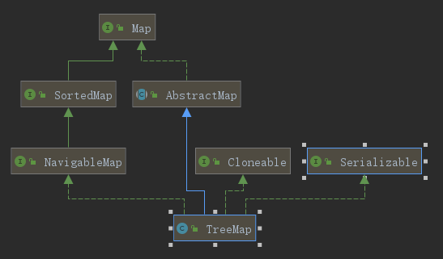

# Java集合面试题

## 集合概述

### 数组到底是不是对象？

先说说对象的概念。对象是根据某个类创建的一个实例，表示某类事物中一个具体的个体。
对象具有各种属性，并且具有一些特定的行为。
站在计算机的角度，对象就是内存中的一个内存块，在这个内存块封装了一些数据，也就是类中定义的各个属性。
所以，对象是用来封装数据的。
java中的数组具有java中其他对象的一些基本特点。比如封装了一些数据，可以访问属性，也可以调用方法。
因此，可以说，数组是对象。
也可以通过代码验证数组是对象的事实。

```java
public class ArrayIsObject {
    public static void main(String[] args) {
        int[] arr = new int[10];
        System.out.println(arr instanceof Object); // true
    }
}
```

### 为什么使用基本类型数组进行Arrays.sort时不能自定义比较器？

Arrays.sort()默认是升序排序，如果要降序排序，需要自定义比较起

Arrays.sort()有多个重载版本，其中针对基本类型数组的版本不接受自定义比较器
具体来说，Arrays.sort有以下几种主要的重载方法

1. `Arrays.sort(int[] a)` : 用于排序`int`数组，按自然顺序排序，不接受比较器
2. `Arrays.sort(T[] a, Comparator<? super T> c)`:用于排序泛型对象数组，按自定义比较起排序

**根本原因**：Comparator 是泛型接口，而泛型不能使用基本类型，因此 Arrays.sort(primitive[], Comparator) 在类型系统层面就不可能存在。

### Comparator和Comparable有什么区别？

Comparator和Comparable都是Java中用于对象排序的接口，它们之间有一下关键的区别。

Comparable接口是在对象自身的类中实现的，它定义了对象的自然排序方式。一个类实现类Comparable接口后，可以使用compareTo方法来比较当前对象和其他对象的大小关系。这个接口只能在对象自身的类中实现，不需要额外的比较器。

Comparator接口是一个独立的比较起，它可以用于对不同类的对象进行排序。Comparator接口允许在对象类之外创建一个单独的比较器或匿名类，并使用它来定义对象的排序规则。比较器通过实现compare()方法来比较两个对象的大小关系。

因此，主要区别如下：

- Comparable接口是在对象自身的类中实现，定义了对象的自然排序方式。
- Comparator接口是一个单独的比较器，定义了用于排序的规则，可以用于不同类的对象排序。
- Comparable是内部排序，对象的类必须实现Comparable接口才能进行排序。
- Comparator是外部排序，可以定义独立的规则，并与任何类的对象一起使用

在使用时，如果需要对对象的默认排序进行操作，可以实现Comparable接口，并重写compareTo()方法。如果需要自定义排序规则，则需要定义一个比较器，并实现Comparator接口，并重写compare()方法。

### Java中的集合框架有哪些核心接口？有什么区别？

Java中的集合提供了一组接口和类，用于存储和操作数据集合。其中一些核心接口包括：

- `Collection`：这是最基本的集合接口，它定义了集合的基本操作，如添加、删除、遍历等。
- `List`：这是继承自Collection的接口，它定义了列表（有序的）操作，如获取索引位置的元素、设置索引位置的元素、获取列表的长度等。
- `Set`：这是继承自Collection的接口，它定义了集合中的元素不重复，即不允许重复元素。
- `Map`：这是继承自Collection的接口，它定义了键值对（键-值）的集合，如获取键对应的值、判断键是否存在、获取键值对个数等。
- `Queue`：这是继承自Collection的接口，它定义了队列操作，如添加元素、移除元素、获取队列长度等。

### 常见的集合有哪些？

Java集合类主要由两个接口Collection和Map派生出来的，Collection有三个子接口List、Set和Queue，而Map有HashMap、LinkedHashMap、TreeMap、Hashtable、Properties等。


### 集合框架底层数据结构总结

#### List

- ArrayList: Object[] 数组
- Vector: Object[] 数组
- LinkedList: 双向链表

#### Queue

- ProrityQueue: Object[] 数组来实现小顶堆
- ArrayDeque: 可扩容动态双向数组
-

#### Set

- HashSet: 无序、唯一，基于HashMap实现，底层采用HashMap存储元素
- LinkedHashSet: 唯一、有序，基于LinkedHashMap实现，底层采用LinkedHashMap存储元素
- TreeSet: 有序、唯一，基于红黑树实现，底层采用红黑树存储元素

#### Map

- HashMap: 基于哈希表实现，键值对存储，不保证有序
- LinkedHashMap: 基于哈希表和链表实现，键值对存储，有序
- TreeMap: 基于红黑树实现，键值对存储，有序
- Hashtable: 基于哈希表实现，键值对存储，不保证有序

#### 并发容器

- CopyOnWriteArrayList: 线程安全的 ArrayList,`CopyOnWriteArrayList`是读写分离的,好处是提高线程访问效率。
- ConcurrentHashMap: 是一个支持高并发更新与查询的哈希表
- ConcurrentLinkedQueue: 线程安全的队列，基于链表实现，FIFO
- BlockingQueue: 阻塞队列，线程安全的队列，支持阻塞操作，如 take()、put()

### 如何选用集合？

主要根据集合的特点来选择合适的集合。

- 如果需要存储唯一的元素，且不要求有序，则使用 HashSet。
- 如果需要存储唯一的元素，且要求有序，则使用 LinkedHashSet。
- 如果需要根据元素的自然顺序排序，则使用 TreeSet。
- 如果需要存储键值对，且不要求有序，则使用 HashMap。
- 如果需要存储键值对，且要求有序，则使用 LinkedHashMap。
- 如果需要根据键的自然顺序排序，则使用 TreeMap。
- 如果需要线程安全的哈希表，则使用 ConcurrentHashMap。
- 如果需要线程安全的队列，则使用 ConcurrentLinkedQueue 或 BlockingQueue。
- 如果需要读写分离的线程安全的列表，则使用 CopyOnWriteArrayList。

## List详解

### ArrayList了解吗？

`ArrayList`的底层是动态数组，它的容量能动态增长。在添加大量元素前，应用可以使用`ensureCapacity`操作增加`ArrayList`实例的容量。ArryList继承了AbstractList类，实现了List接口。

### ArrayList和Array(数组)的区别？

`ArrayList`内部基于动态数组实现，比`Array`(静态数组)使用起来更加灵活：

- `ArrayList`会根据实际存储的元素动态地扩容或缩容，而`Array`被创建之后就不能改变它的长度了。
- `ArrayList`允许使用泛型来确保类型安全，而`Array`则不能。
- `ArrayList`中只能存储对象。对于基本类型数据，需要使用其对于的包装类（如Integer、Double、Character、Boolean等）。`Array`可以直接存储基本数据类型，也可以存储对象。
- `ArrayList`支持插入、删除、遍历等常见操作，并且提供了丰富的API操作方法，比如`add()`、`remove()`等。`Array`只是一个固定长度的数组，只能按照下标访问其中的元素，不具备动态添加、删除元素的能力。
- `ArrayList`创建时不需要指定大小，而`Array`需要在创建时指定大小。

### ArrayList的扩容机制？

ArrayList的扩容本质就是计算出新的扩容数组的size后实例化，并将原有数组内容复制到新数组中去。默认情况下，**新的容量会是原容量的1.5倍** 以JDK1.8为例：

```java
public boolean add(E e) {
    // 1. 检查是否需要扩容
    ensureCapacityInternal(size + 1);  // Increments modCount!!
    // 2. 新增元素
    elementData[size++] = e;
    return true;
}
// 每次在add()一个元素时，arrayList都会检查是否需要扩容，如果需要则调用ensureCapacityInternal()方法
private void ensureCapacityInternal(int minCapacity) {
    ensureExplicitCapacity(calculateCapacity(elementData, minCapacity));
}

private static int calculateCapacity(Object[] elementData, int minCapacity) {
    // 如果传入的是个空数组则最小容量取默认容量与minCapacity之间的最大值
    if (elementData == DEFAULTCAPACITY_EMPTY_ELEMENTDATA) {
        return Math.max(DEFAULT_CAPACITY, minCapacity);
    }
    return minCapacity;
}

private void ensureExplicitCapacity(int minCapacity) {
    modCount++;
    // 若ArrayList已有的存储能力满足最低存储要求，则返回add直接添加元素；如果最低要求的存储能力>ArrayList的存储能力，则扩容
    if (minCapacity - elementData.length > 0)
        grow(minCapacity);
}

private void grow(int minCapacity) { 
    // 获取elementData数组的内存空间长度
    int oldCapacity = elementData.length;
    // 扩容至原来的1.5倍
    int newCapacity = oldCapacity + (oldCapacity >> 1);
    // 检查容量是否足够
    if (newCapacity - minCapacity < 0)
        newCapacity = minCapacity;
    // 若预设值大于默认的最大值，检查是否溢出
    if (newCapacity - MAX_ARRAY_SIZE > 0)
        newCapacity = hugeCapacity(minCapacity);
    // 调用Arrays.copyOf()方法将elementData数组指向新的内存空间
    // 并将原有数组内容复制到新数组中去
    elementData = Arrays.copyOf(elementData, newCapacity);
}

```

### 怎么在遍历ArrayList时移除一个元素？

foreach删除时会导致快速失败问题，可以使用迭代器的remove方法

```java
Iterator itr = list.iterator();
while(itr.hasNext()){
    if (itr.next().equals(element)){
        itr.remove();
    }
}
```

### ArrayList和Vector的区别？

1. ArrayList在内存不够时扩容为1.5倍，而Vector扩容为2倍。
2. ArrayList线程不安全，Vector线程安全。但是操作Vector效率比较低

### Vector和Stack的区别？

- `Vector`和`Stack`都是线程安全的，都是使用`synchronized`关键字修饰的。
- `Stack`继承自`Vector`，`Stack`是一个后进先出（LIFO）的栈，而`Vector`是一个动态数组。

随着Java并发编程的发展，`Vector`和`Stack`已经不再被推荐使用，因为`Vector`和`Stack`的线程安全实现方式存在效率问题。推荐使用并发集合类（例如`ConcurrentHashMap`、`ConcurrentLinkedQueue`等）

### ArrayList可以添加null值吗？

`ArrayList`可以添加`null`值，因为`ArrayList`内部使用`Object[]`数组来存储元素，`Object`类允许存储`null`值。`不过不建议向ArrayList中添加null值，因为null值无意义，会让代码难以维护比如忘记做判空处理就会导致空指针异常

### ArrayList插入和删除元素的时间复杂度？

对于插入：

- 头部插入：时间复杂度O(n)，因为需要将数组中的元素向右移动一位。
- 尾部插入：时间复杂度O(1)，因为只需要在数组末尾添加一个元素。当容量已达到极限并且需要扩容时，则需要执行一次O(n)的操作将原数组复制到新的更大的数组中，然后再执行O(1)的插入操作。
- 中间插入/指定位置插入：时间复杂度O(n)，因为需要将插入位置后面的元素向右移动一位。

对于删除：

- 头部删除：时间复杂度O(n)，因为需要将数组中的元素向左移动一位。
- 尾部删除：时间复杂度O(1)，因为只需要删除数组末尾的一个元素。
- 中间删除/指定位置删除：时间复杂度O(n)，因为需要将删除位置后面的元素向左移动一位。

### LinkedList插入和删除元素的时间复杂度？

- 头部插入/删除：时间复杂度O(1)，因为只需要改变头指针的指向。
- 尾部插入/删除：时间复杂度O(1)，因为只需要改变尾指针的指向。
- 中间插入/删除：时间复杂度O(n)，因为需要先遍历到指定位置，然后改变指针的指向。

### LinkedList为什么不能实现RandomAccess接口？

`RabdomAccess`是一个标记接口，用来表明实现该接口的类支持随机访问（即可以通过索引快速访问元素）。由于`LinkedList`的底层数据结构是链表，内存地址不连续，只能通过指针来定位，不支持随机访问，所以不能实现`RandomAccess`接口。

### ArrayList和LinkedList的区别？

- 是否保证线程安全：都是非线程安全的。
- 底层数据结构：ArrayList基于Object数组实现，LinkedList基于双向链表实现。
- 插入和删除性能受元素位置的影响：
  
  - ArrayList的插入和删除性能受元素位置的影响。
  - LinkedList的插入和删除性能不受元素位置的影响，因为只需要改变指针的指向。
- 随机访问性能：`LinkedList`的随机访问性能比`ArrayList`要差，因为需要遍历链表。`ArrayList`的随机访问性能比`LinkedList`要好，因为不需要遍历链表。`
- 内存空间占用：`ArrayList`的空间浪费主要体现在list列表的结尾会预留一定的容量空间，而`LinkedList`的空间花费主要体现在它的每一个元素都需要消耗比ArrayList更多的内存空间。

### ArrayList和LinkedList如何选用？

一般是不会用到LinkedList的，需要用到LinkedList的场景都可以使用ArrayList来代替。并且，性能通常会更好！

选择ArrayList还是LinkedList主要取决于对集合的操作模式

- 选择ArrayList的场景：读多写少，特别是需要频繁地通过索引进行随机访问
- 选择LinkedList的场景：读少写多，需要频繁地插入和删除元素

### LinkedList一定最适合元素增删场景吗？

不一定，LinkedList的随机访问性能比ArrayList要差，所以如果需要频繁地通过索引进行随机访问，那么ArrayList会更合适。

## Queue

### Queue与Deque的区别？

`Queue`是单端队列，只能从一端插入元素，另一端删除元素，实现上一般遵循先进先出规则

`Deque`是双端队列，支持两端插入和删除，可以当作队列或栈使用，更加灵活，适用于需要从两端操作数据的场景。

### 讲一下ArrayDeque

`ArrayDeque`实现类双端队列的接口，内部使用循环数组实现，默认大小为16。它的特点有：

1. 在两端添加、删除元素的效率较高
2. 根据元素内容查找和删除的效率比较低
3. 没有索引位置概念，不能通过索引访问元素

### ArrayQueue与LinkedList的区别？

`ArrayQueue`和`LinkedList`都实现了`Queue`接口，它们的区别为:

- `ArrayQueue`是基于可变长的数组和双指针来实现，而`LinkedList`则通过链表来实现。
- `ArrayQueue`不支持NULL存储，而`LinkedList`支持NULL存储。

从性能的角度上，选用AraayDeque来实现队列比LinkedList更好。此外ArrayDeque也可以用于实现栈

ArrayDeque和LinkedList都是线程不安全的，可以使用Collections工具类中synchronizedXxx()转换成线程同步。

### 说一说PriorityQueue

`PriorityQueue`是一个基于优先级堆的队列，它按照优先级顺序返回队列中的元素。

- `PriorityQueue`利用了二叉堆的数据结构来实现，底层使用可变长的数组来存储数据
- `PriorityQueue`通过堆元素的上浮和下沉，实现了在O(logn)的时间复杂度内插入和删除堆顶元素
- `PriorityQueue`是非线程安全的，且不支持存储null元素和non-comparable的对象
- `PriorityQueue`默认是小顶堆，但可以接收一个Comparator作为构造函数，从而来自定义元素优先级的先后。

## Set

### HashSet的底层原理？

HashSet基于HashMap实现。放入HashSet中的元素实际上由HashMap的key来保存的。而HashMap的value则存储了一个静态的Object对象。

```java
public class HashSet<E> extends AbstractSet<E> implements Set<E>, Cloneable, Serializable {
    private transient HashMap<E,Object> map;
    private static final Object PRESENT = new Object();
    public HashSet() {
        map = new HashMap<>();
    }
}
```

### HashSet、LinkedHashSet、TreeSet区别?

- `HashSet`、`LinkedHashSet`、`TreeSet`都是`Set`接口的实现类。`都能保证元素唯一，并且都不是线程安全的。
- `HashSet`、`LinkedHashSet`和`TreeSet`的主要区别在于底层数据结构不同。HashSet底层数据结构是HashMap，LinkedHashSet底层数据结构是链表和哈希表，元素的插入和取出顺序满足FIFO。TreeSet底层数据结构是红黑树，元素是有序的，排序的方式有自然排序和定制排序。
- 底层数据结构不同又导致这三者的应用场景不同。HashSet用于不需要保证元素插入和取出顺序的场景，LinkedHashSet用于需要保证元素插入和取出顺序满足FIFO的场景，TreeSet用于需要对元素进行自定义排序的场景。
- HashSet是Set接口的主要实现类，HashSet的底层数据结构是HashMap，线程不安全，可以存储null值
- LinkedHashSet是HashSet的子类，能够按照添加的顺序遍历
- TreeSet底层使用红黑树，能够按照添加的顺序遍历，排序的方式可以自定义。

### 无序性和不可重复性的含义是什么

- 无序性不等于随机性，无序性是指存储的数据在底层数组中并非按照数组索引的顺序添加，而是根据数据的哈希值决定的。
- 不可重复性是指添加的元素按照equals()判断时，返回false,需要同时重写equals()方法和hashCode()方法

## Map

Map中常用的集合就是HashMap

HashMap使用数组+链表+红黑树（JDK1.8增加了红黑树）实现的，链表长度大于8时，会把链表转换为红黑树，红黑树节点个数小于6时才转化为链表，防止频繁的转化。

### 解决hash冲突的方法有哪些？HashMap用的哪种？

解决Hash冲突的方法有：拉链法、开放地址法、再散列法。HashMap用的是拉链法

- 开发地址法基本思想就是，如果p=H(key)出现冲突时，则以p为基础，再次hash,p1=H(p),如果p1再次出现冲突，则以p1为基础，再次hash,p2=H(p1),以此类推，直到找到一个没有冲突的hash值。因此开发地址法所需要的hash表的长度要大于等于所需要存放的元素，而且因为存在再次hash,所以只能在删除的节点上做标记，而不能真正删除节点。
- 再哈希法提供多个不同的hash函数，当R1=H1(k1)发生冲突时，再计算R2=H2(k1),直到没有冲突为止。这样做虽然不易产生堆集，但增加了计算的时间。
- 拉链法将哈希值相同的元素构成一个同义词的单链表，并将单链表的头指针存放在哈希表的第i个单元中，查找、插入和删除主要在同义词链表中进行。链表法适用于经常进行插入和删除的情况。

### HashMap使用的hash算法？

Hash算法：取key的hashCode值、高位运算、取模运算。
```
h = key.hashCode();
h^(h>>>16)
return h&(length-1);
```

在JDK1.8的实现中，优化了高位运算的算法，通过`hashCode()`的高16位异或或低16位实现的：这么做可以在数组比较小的时候，也能考虑到高低位都参与到Hash的计算中，可以减少冲突，同时不会有太大的开销。

### 为什么建议设置HashMap的容量？

HashMap有扩容机制，就是当达到扩容条件时会进行扩容。扩容条件就是当HashMap的元素个数超过临界值就会扩容（threshold=capacity*loadFactor）

如果没有设置初始容量大小，随着元素的不断添加，HashMap会发生多次扩容。而HashMap每次扩容都需要重建hash表，非常影响性能。所以建议开发者在创建HashMap时，尽量设置一个合适的初始容量大小，这样能避免扩容带来的性能问题。

### hashCode()和equals()的重要性

hashMap的键必须实例hashCode()和equals()方法。hashCode()用于计算哈希值，以决定键的存储位置，而equals()则用于比较两个键是否相同，在put操作时，如果两个键的hashCode()值相同，但equals()返回false，则两个键会被认为不同，存储在一个桶的不同位置。

误用hashCode()和equals()方法会导致HashMap中的元素无法正常查找或插入。

### HashMap扩容过程是怎样的

1.8扩容机制：当元素个数大于`threshold`时，会触发扩容,使用2倍容量的数组替代原有数组。采用尾插法的方式将原有数组拷贝到新数组。1.8扩容之后链表元素相对没有变化，而1.7扩容之后链表会倒置。

1.7扩容机制：当元素个数大于`threshold`时，会触发扩容,使用2倍容量的数组替代原有数组。采用头插法将原有数组拷贝到新数组。头插法可能会导致两个线程中出现元素的相互指向而形成循环链表。1.8中已解决

原数组的元素在重新计算hash之后，因为数组容量n变为2倍，那么n-1的mask范围在高位多1bit。在元素拷贝过程不需要重新计算元素在数组中的位置，只需要看看原来的hash值新增的那个bit是1还是0，是0的话索引没变，是1的话索引变成原索引+oldCap。这样可以省去重新计算hash值的时间，而且由于新增的1bit是0还是1可以认为是随机的，因此resize的过程会均匀的把之前的冲突的节点分散到新的bucket。

### HashMap扩容机制的性能影响

扩容触发条件：当HashMap中的元素超过容量*负载因子时，会触发扩容。扩容会将容量扩展位为当前容量的2倍，并将所有键值对重新分配到新的桶中(bucket)中。

性能影响：扩容是一个耗时的操作，因为它需要重新计算每个键的哈希值，并将键值对重新分配到新的桶中。因此，频繁的扩容会显著影响性能，特别是在存储大量数据时。

### 为什么HashMap在扩容时采用2的n次方倍？

原因是：为了能让HashMap存取高效，尽量较少碰撞，也就是要尽量把数据分配均匀。

HashMap通过（n-1）&hash来计算元素存储的索引位置，这种位运算只有在数组长度是2的n次方时才能确保索引均匀分布，位运算的效率高于取模运算（hash%n）,提高了哈希计算的效率。

且当HashMap扩容时，通过容量为2的n次方，扩容时只需要通过简单的位运算判断是否需要迁移，这减少了重新计算哈希值的开销，提升了rehash的效率。

### 说说HashMap的put方法流程？

put方法流程：
1. 如果table没有初始化就先进行初始化过程
2. 使用hash算法计算key的索引判断索引处有没有存在元素，没有就直接插入。
3. 如果索引存在元素，则遍历插入，有两种情况，
   - 一种是链表形式就直接遍历到尾端插入；
   - 一种是红黑树结构就调用红黑树的插入方法。
4. 插入链表的数量大于阈值8，且数组大小已经大等于64，就要转换成红黑树的结构
5. 添加成功后会检查是否需要扩容。

### 红黑树的特点

- 每个节点或者黑色，或者是红色
- 根节点和叶子节点都是黑色
- 如果一个节点是红色的，那么它的子节点都是黑色的
- 从一个节点到该节点所有后代节点的叶子节点，经过的黑色节点数相同

### 在解决哈希冲突的时候，为什么选择先用链表，再转红黑树？

因为红黑树需要进行左旋、右旋、变色等操作来保持平衡，而单链表不需要。所以，当元素个数小于8个的时候，采用链表结构可以保证查询性能。而当元素个数大于8个的时候并且数组容量大于64的时候，会采用红黑树结构。因为红黑树搜索时间复杂度是O(logn)，而链表搜索时间复杂度是O(n)。在n比较大的时候，使用红黑树可以加快查询速度。

### HashMap默认加载因为为什么是0.75？

因为它提供了空间和时间复杂度之间的良好平衡。负载因子太低会导致大量的空桶浪费空间，负载因子太高会导致大量的碰撞，降低性能。0.75的负载因子在这两个因素之间取得了良好的平衡。

也就是说，0.75是对空间和时间效率的一个平衡选择，根据泊松分布，loadFactory取0.75碰撞最小。一般不会修改，除非在时间和空间比较特殊的情况下：

- 如果内存空间充足而又对时间效率要求很高，可以降低loadFactory的值。
- 如果内存空间不足而又对空间效率要求很高，可以增加loadFactory的值，这个值可以大于1。

### 一般用什么作为HashMap的key

一般用`Integer`、`String`这种不可变的类作为HashMap的key，String类比较常用。


### 使用HashMap时，有哪些提升性能的技巧？

- 合理设置初始容量：如果在使用时可以预估HashMap存储的数据量大小，那么在创建时设置一个合适的初始容量，以避免频繁的扩容操作。Java8的HashMap默认的初始容量是16。
- 调整负载因子：官方提供的默认负载因子是0.75，如果数据量较大，可以根据具体应用场景调整这个值。


### HahsMap为什么线程不安全？

- 多线程下扩容死循环。JDK1.7中的HashMap使用头插法插入元素，在多线程的环境下，扩容的时候有可能导致环形链表的出现，形成死循环 
- 在JDK1.8中，在多线程环境下，put不安全，会发生数据覆盖的情况。

JDK1.8中，put的不安全

由于多线程对HashMap进行put操作，调用HashMap的putVal(),具体原因：


第一种情况：
1. 假设两个线程A、B都在进行put操作，并且hash函数计算出的下标是相同的；
2. 当线程A执行完第6行由于时间片耗尽导致被挂起，而线程B得到时间片后在该下标处插入了元素，完成了正常的插入；
3. 接着线程A获得时间片，由于之前已经进行了hash碰撞的判断，所以此时不会再进行判断，而是直接进行插入；
4. 最终就导致了线程B插入的数据被线程A覆盖了，从而线程不安全。

第二种情况：
1. 代码的第40行处有个++size,线程A、B这两个线程同时进行put操作时，假设当前HashMap的size为10；
2. 当线程A执行到第40行时，从主内存中获得size的值为10后准备进行+1操作，但是由于时间片耗尽只好让出cpu;
3. 接着线程B拿到CPU后从主内存中拿到size的值进行+1操作，完成了put操作并将size=11写回主存；
4. 接着线程A再次CPU并继续执行（此时size的值仍是10），当执行完put操作后，还是将size=11写回主存;
5. 此时，线程A、B都进行了put操作，但是size的值只增加了1，所以说还是由于数据覆盖导致了线程不安全。

```java
1 final V putVal(int hash, K key, V value, boolean onlyIfAbsent,
2 											boolean evict) {
3 	Node <K, V> [] tab; Node <K, V> p; int n, i;
4	if ((tab = table) == null || (n = tab.length) == 0)
5 		n = (tab = resize()).length;
6	if ((p = tab[i = (n - 1) & hash]) == null) //
        tab[i] = newNode(hash, key, value, null);
    else {
        Node < K, V > e;
        K k;
        if (p.hash == hash &&
            ((k = p.key) == key || (key != null && key.equals(k))))
            e = p;
        else if (p instanceof TreeNode)
            e = ((TreeNode <K, V> ) p).putTreeVal(this, tab, hash, key, value);
        else {
            for (int binCount = 0;; ++binCount) {
                if ((e = p.next) == null) {
                    p.next = newNode(hash, key, value, null);
                    if (binCount >= TREEIFY_THRESHOLD - 1) // -1 for 1st
                        treeifyBin(tab, hash);
                    break;
                }
                if (e.hash == hash &&
                    ((k = e.key) == key || (key != null && key.equals(k))))
                    break;
                p = e;
            }
        }
        if (e != null) { // existing mapping for key
            V oldValue = e.value;
            if (!onlyIfAbsent || oldValue == null)
                e.value = value;
            afterNodeAccess(e);
            return oldValue;
        }
    }
    ++modCount;
    
40  if (++size > threshold)
        resize();
    afterNodeInsertion(evict);
    return null;
}
```

### HashMap和Hashtable的区别?

HashMap和Hashtable都实现了Map接口

1. null值：HashMap可以接受null的key和value,key为null的键值放在下标为0的头结点的链表中，而Hashtable则不行
2. 线程安全性：HashMap是非线程安全的，Hashtable是线程安全的，jdk1.5提供了ConcurrentHashMap类，它是Hashtable的替代。因为线程安全的问题，HashMap要比Hashtable效率高一点。另外，Hashtable基本被淘汰，不要在代码中使用它；
3. 继承和使用实现：Hashtable继承自Dictionary类，而HashMap则继承自AbstractMap类，并且实现了Map接口。
4. 使用性能：Hashtable很多方法是同步方法，在单线程环境下它比HashMap要慢。
5. 哈希值的使用不同：Hashtable直接使用对象的hashCode,而HashMap重新计算hash值
6. 初始容量和扩容机制：Hashtable在创建时必须指定容量大小，且默认大小为11。而HashMap在创建时可以不指定容量大小，系统会自动分配初始容量，并采用2倍扩容机制。
7. 迭代器：迭代器Iterator对Hashtable是安全的。而Iterator对HashMap是不安全的，因为迭代器被设计为工作于一个快照上，如果在迭代过程中其他线程修改了HashMap，迭代器将抛出ConcurrentModificationException异常。

### HashMap和HashSet的区别？

HashSet的底层就是基于HashMap实现的。

### 讲一下TreeMap?

TreeMap是一个能比较元素大小的Map集合，会对传入的key进行大小排序。可以使用元素的自然顺序，也可以使用集合中自定义的比较器来进行排序。

```java
public class TreeMap<K,V> extends AbstractMap<K,V> implements NavigableMap<K,V>, Cloneable, java.io.Serializable { }
```

TreeMap的继承结构：


**TreeMap的特点：**
1. TreeMap是有序的k-v集合，通过红黑树实现。根据键的自然顺序进行排序或根据提供的Comparator进行排序。
2. TreeMap继承了AbstractMap类，实现了NavigableMap接口，支持一系列的导航方法，给定具体搜索目标，可以返回最接近的匹配项。

### HashMap和TreeMap区别？

TreeMap和HashMap都继承自AbstractMap类，但是TreeMap还继承了NavigableMap接口，因此TreeMap除了支持Map的所有方法外，还支持一系列的导航方法，给定具体搜索目标，可以返回最接近的匹配项。

### LinkedHashMap的底层原理？

HashMap是无序的，迭代HashMap所得到的元素的顺序并不是它们最初放到HashMap的顺序，即不能保持它们的插入顺序。

LinkedHashMap继承于HashMap,是HashMap和LinkedList的融合体，具备两者的特性。每次put操作都会将entry插入到双向链表的尾部。

使用场景：
  
  - 缓存实现：可以根据访问顺序移除最久未使用的元素，常用语LRU缓存
  - 数据存储：需要保持元素插入顺序的场景

### IdentityHashMap是什么？

IdentityHashMap是一个Map实现，和普通的HashMap不同，IdentityHashMap使用引用相等性来作为键的比较方式。换句话说，它使用==比较键，而不是equals方法，因此，只有当两个键的引用相同时，才被认为是相同的键

使用场景：

- 对象身份区分：适用于需要基于对象身份进行区分的场景，比如需要跟踪对象实例，而不是逻辑上的值相等。
- 特殊缓存：有时用于构建缓存或映射结构，确保即使两个对象内容相同，但只要它们是不同的实例，就会被当作不同的键。

主要特性：

- 引用相等：
- 哈希实现：
- 允许null键和null值
- 非线程安全

### WeakHashMap是什么？

WeakHashMap是一个Map实现，它使用弱引用作为键的引用方式。弱引用允许垃圾回收器在没有其他强引用指向该对象时指向该对象时回收它的内存。因此，当一个键不再被其他对象引用时，会自动删除与该键关联的条目。

常用于缓存（内存敏感场景cache）的实现。当缓存中的键不再被其他地方引用时，可以自动移除相应的缓存条目，节省内存，防止内存泄漏。

## 并发容器

JDK提供的这些容器大部分在`java.util.concurrent`包中`

 - ConcurrentHashMap: 线程安全的hashMap
 - CopyOnWriteArrayList: 线程安全的List,在读多写少的场合性能非常好，远远好于Vector
 - ConcurrentLinkedQueue: 高效的并发队列，使用链表实现。可以看做一个线程安全的LinkedList,这是一个非阻塞队列
 - BlockingQueue: 阻塞队列接口，JDK内部通过链表、数组等方式实现了这个接口。非常适用于作为数据共享的通道
 - ConcurrentSkipListMap: 跳表的实现。使用跳表的数据结构进行快速查找。

### 什么是fail fast?

边遍历边修改集合就会产生fast-fail事件，抛出ConcurrentModificationException异常

fast-fail是Java集合的一种错误机制。当多个线程对同一个集合进行操作时，就有可能会产生fast-fail事件。
例如：当线程a正通过Iterator遍历集合时，线程b修改了集合的内容，此时modCount(记录集合操作过程的修改次数)会加1，不等于expectedModeCount,那么线程a访问集合的时候，就会抛出ConcurrentModificationException异常,产生fast-fail事件。

解决方法：

- 使用Collections.synchronizedList方法或在修改集合内容的地方加上synchronized关。这样的话，增删集合内容的同步锁会阻塞遍历操作，影响性能。
- 使用CopyOnWriteArrayList来替换ArrayList。在对CopyOnWriteArrayList进行修改操作的时候，会拷贝一个新数组，对新的数组进行操作，操作完成后再把引用移到新的数组。

### 什么是fail-safe?

采用安全失败机制的集合容器，在遍历时不是直接在集合内容上访问的，而是先复制原有集合内容，在拷贝的集合上进行遍历。java.util.concurrent包下的容器都是fail safe,可以在多线程下并发使用，并发修改。

原理：由于迭代时是对原集合的拷贝进行遍历，所以在遍历过程中对原集合所作的修改并不能被迭代器检测到，所以不会触发Concurrent Modification Exception。

缺点：基于拷贝内容的优点是避免了Concurrent Modification Exception，但同样的，迭代器并不能访问到修改后的内容，即：迭代器遍历的是开始遍历哪一刻拿到的集合拷贝，在遍历期间原集合发生的修改迭代器是不知道的。

### 哪些集合是线程安全的？哪些集合不安全？

线程安全的集合：

- Vector: 比ArrayList多了同步机制
- Hashtable。
- ConcurrentHashMap：是一种高效并且线程安全的集合。
- Stack: 栈，也是线程安全的，继承于Vector。

线程不安全的集合类：

- HashMap
- ArrayList
- LinkedList
- HashSet
- TreeSet
- TreeMap

### 迭代器Iterator是什么？

Iterator模式用同一种逻辑来遍历集合。它可以把访问逻辑从不同类型的集合中抽象出来，不需要了解集合内部实现便可以遍历集合元素，统一使用Iterator接口来遍历集合元素。它的特点是更加安全，因为它可以保证，在当前遍历到集合元素被更改的时候，就会抛出ConcurrentModificationException异常。

```java
public interface Collection<E> extends Iterable<E> { 
    Iterator<E> iterator();
}
```

主要有三个方法：hasNext()、next()、remove()

### Iterator和ListIterator有什么区别？

ListIterator是Iterator的增强版。

- ListIterator遍历可以是逆向的，因为有previous()和hasPrevious()方法,而Iterator不可以。
- ListIterator有add()方法，可以向List添加对象，而Iterator没有。
- ListIterator可以定位当前的索引位置，因为有nextIndex()和previousIndex()方法，而Iterator没有。
- ListIterator有set()方法，可以修改当前索引位置的元素，而Iterator没有。
- ListIterator只能遍历List及其子类，Iterator可以遍历任意实现了Iterable接口的类。

### Iterator与for-each循环的关系

for-each循环实际上是对Iterator的一种简化形式。背后是通过Iterator实现的。

不过for-each适合只遍历而不进行删除等操作。如果需要在遍历过程中修改集合内容，则需要使用Iterator。

因为iterator在遍历集合的过程中，如果检测到集合的结构发生了非迭代器自身的修改（比如使用List#add()、List#remove()等直接修改集合），则抛出ConcurrentModificationException异常。）这种机制称为“fail-fast”。

为了避免这种情况发生，修改集合时应使用Iterator去操作集合，而不是直接操作集合。

### 如何让一个集合不被修改？

可以采用Collections包下的unmodifiableXXX方法,通过这个方法返回的集合，是不可以修改的。如果修改的话，会抛出java.lang.UnsupportedOperationException异常。

```java
List<String> list = new ArrayList<String>();
list.add("1");
Collection<String> clist = Collections.unmodifiableCollection(list);
clist.add("2"); // 抛出java.lang.UnsupportedOperationException异常
```

对于List/Set/Map集合，Collections包都有相应的支持。
当然，用Guava工具的Immutable类更好，比Collections包更有优势

**那使用final关键字进行修饰可以实现吗**
不可以。
final关键字修饰的成员变量如果是引用类型的话，则表示这个引用的地址值是不能改变的，但是这个引用所指向的对象里面的内容还是可以改变的。
而集合类都是引用类型，所以final关键字修饰的集合类对象，集合类对象里面的内容是可以改变的。


### CopyOnWrite

Copy-On-Write，写时复制。当我们往容器添加元素时，不直接往容器添加，而是先将当前容器进行复制，复制出一个新的容器，然后往新的容器添加元素，添加完元素之后，再将原容器的引用指向新容器。这样做的好处是可以对`CopyOnWrite`容器进行并发的读，而不需要加锁，因为当前容器不会被修改。
```java
public boolean add(E e) { 
    final ReentrantLock lock = this.lock;
    lock.lock();
    try { 
        Object[] elements = getArray();
        int len = elements.length;
        Object[] newElements = Arrays.copyOf(elements, len + 1); // 复制新数组
        newElements[len] = e;
        setArray(newElements);// 原容器的引用指向新容器
        return true;
    } finally { 
        lock.unlock();
    }
}

```

从JDK1.5开始Java的并发包里提供了两个使用CopyOnWrite机制实现的并发容器，它们是`CopyOnWriteArrayList`和`CopyOnWriteArraySet`

缺点：

- 内存占用问题。由于CopyOnWrite的写时复制机制，在进行写操作的时候，内存里会同时驻扎两个对象占用内存。
- CopyOnWrite容器不能保证数据的实时一致性，可能读到旧数据

### CopyOnWriteArrayList

CopyOnWriteArrayList是Java并发包中提供的一个并发容器。CopyOnWriteArrayList相当于线程安全的ArrayList,CopyOnWriteArrayList使用了写时复制机制，当有新元素add到其中时，先从原有的数组拷贝一份出来，然后在新的数组做写操作，写完之后，再将原来的数组引用指向新数组。

`CopyOnWriteArrayList`中add方法添加的时候是需要加锁的，保证同步，避免了多线程写的时候复制出多个副本。读的时候不需要加锁，如果读的时候有其他线程正在向CopyOnWriteArrayList中添加数据，还是可以读到旧数据。

### CopyOnWriteArrayList和Vector

- CopyOnWriteArrayList的写效率比Vector慢。CopyOnWriteArrayList写元素时是通过备份数组的方式实现的，当多线程同步激烈，数据量较大时会不停的复制数组，内存浪费严重。如果原数组的内容比较多的情况下，可能导致young gc或者full gc。
- 弱一致性：不能用于实时读的场景，像拷贝数组、新增元素都需要时间，所以读取数据可能是旧的，虽然CopyOnWriteArrayList能做到最终一致性，但是还是没法满足实时性要求。

CopyOnWriteArrayList适合读多写少的场景，例如黑白名单等。

### CopyOnWriteArrayList和Collections.synchronizedList有什么区别？分别有什么优缺点？

CopyOnWriteArrayList：是一个线程安全的 List 实现，特性就是写时复制。每次对 List 的修改操作(如 add,set,remove)都会复制创建一个新的底层数组。读操作不需要加锁，写操作需要加锁。

- 优点： 读操作无锁：每次写操作都会创建并复制新数组，所以读写之间不冲突，因此读操作不需要加锁，能够提供非常高效的并发读性能。
- 缺点：写操作开销大：每次写操作都会创建并复制新数组，且要将数据复制到新的数组中，在写操作频繁的场景下性能会较低。内存消耗大：每次写操作都会创建并复制新数组，在数据量大的情况下，同一时刻会存在两倍 List 大小的内存占用，开销较大。

CopyOnWriteArrayList适合读多写少的场景。

Collections.synchronizedList: 是一个包装方法，可以将任何list转换为线程安全的版本，它会对每个访问方法（如get()、set()、add()、remove()等）加锁。从而保证线程安全。
优点：方便
缺点：性能不高

Collections.synchronizedList适用于简单将List转为线程安全版本临时使用的场景。特定的场景还需使用并发度高的JUC类。

### ConcurrentHashMap

多线程环境下，使用HashMap进行put操作会造成数据覆盖，应该使用支持多线程的ConcurrentHashMap
