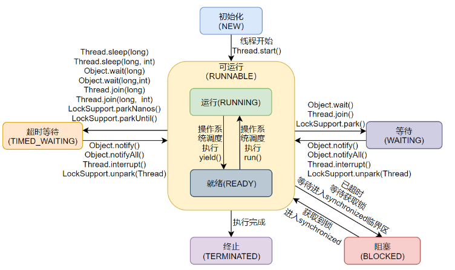
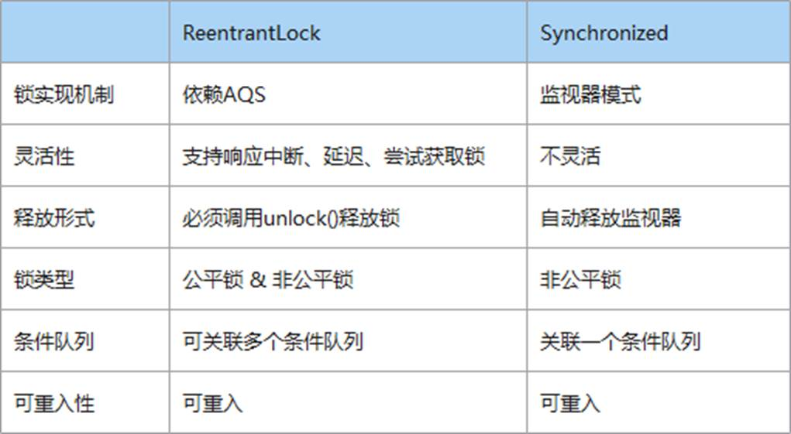

# Java并发面试题

## 并发编程理论基础
### 什么是线程同步？
线程同步是指在多线程环境下，为了避免多个线程对共享资源进行同时访问，从而引发数据不一致或其他问题的一种机制。

它通过对关键代码段加锁，使得同一时刻只有一个线程能够访问共享资源，当多个线程共享同一资源（如变量、对象或文件）时，若没有同步机制，可能会导致竞态条件，即线程对共享资源的操作是非原子性的，多个线程之间可能会同时修改数据，导致结果不符合预期。

### 线程安全是什么意思?
线程安全是指多个线程访问某一共享资源时，能够保证一致性和正确性，即无论线程如何交替执行，程序都能够产生预期的结果，且不会出现数据竞争或内存冲突。
在Java中，线程安全的实现通常依赖于同步机制和线程隔离技术。

### 聊聊JMM内存模型？
Java内存模型（即 Java Memory Model，JMM）是 Java 语言规范中定义的，用于描述 Java 运行时环境如何执行内存操作。JMM 是 Java 语言的实现者定义的，并不存在标准。
主要分成两部分来看，一部分叫主内存，另一部分叫工作内存。

- Java中的共享变量；都放在主内存中，如类的成员变量（实例变量），还有静态的成员变量（类变量），都是存储在主内存中的。每一个线程都可以访问主内存；
- 每一个线程都有自己的工作内存，当线程要执行代码的时候，就必须在工作内存中完成。比如线程操作共享变量，它是不能直接在主内存中操场共享变量的，只能给将共享变量先复制一份，放到线程自己的工作内存当中，线程在其工作内存对该复制过来的共享变量处理完后，再将结果同步回主内存去。

> 主内存是所有线程都共享的，都能访问的。所有的共享变量都存储于主内存；共享变量主要包括类当中的成员变量，以及一些静态变量等。局部变量是不会出现在主内存当中的，因为局部变量只能线程自己使用；工作内存每一个线程都有自己的工作内存，工作内存只存储该线程对共享变量的副本。线程对变量的所有读写操作都必须在工作内存中完成，而不能直接读写主内存中的变量，不同线程之间也不能直接访问对方工作内存中的变量；线程对共享变量的操作都是对其副本进行操作，操作完成之后再同步回主内存当中。

**JMM的同步约定：**

- 线程解锁前，必须把共享变量立刻刷到主内存
- 线程加锁前，必须读取主存中的最新值到工作内存中
- 加锁和解锁是同一把锁

### 什么是Java的happens-before规则？

happens-before规则是Java内存模式（Java Memory Model）中的核心概念
用于定义多线程程序中操作的可见性和顺序性。它通过指定系统操作之间的顺序关系确保线程间的操作是有序的，避免由于重排序或线程间数据不可见导致的并发问题。

happens-before规则的主要规则：

- 程序次序规则：在一个线程中，代码的执行顺序是按照程序的书写顺序执行的，即一个线程内，前面的操作happens-before后面的操作。
- 监视器锁规则：一个锁的解锁（unlock）happens-before后续对这个锁的加锁（lock）操作。也就是说，在释放锁之前的所有修改在加锁后对其他线程可见。
- volatile变量规则：volatile变量的写操作happens-before后续对这个变量的读操作。它保证volatile变量的可见性，确保一个线程修改volatile变量后其他线程能立即看到最新值。
- 线程启动规则：线程A执行Thread.start()操作后，线程B的所有操作happens-before线程A的Thread.start()调用。
- 线程终止规则：线程A执行Thread.join()操作后，线程B的所有操作happens-before线程A从Thread.join()返回。
- 线程中断规则：对线程的interrupt()调用happens-before线程检测到中断时间（通过Thead.interrupted()或Thread.isInterrupted()）
- 对象的构造规则: 对象的构造完成（即构造函数执行完毕）happens-before该对象的finalize()方法调用。

### 如何理解Java并发中的原子性？
原子性（Atomicity）:在一次或多次操作中，要么所有的操作都执行，并且不会受其他因素干扰而中断，要么所有的操作都不执行;

原子性的问题是由CPU的分时复用引起的。
```java
int i = 1;
// 线程1
i += 1;
// 线程2
i += 1;
```
这里需要注意的是：i += 1 需要三条CPU指令

1.将变量i从内存读取到CPU寄存器；
2.在CPU寄存器中执行i+1操作
3.将最后的结果i写入内存（缓存机制导致可能写入的是CPU缓存而不是内存）

由于CPU分时复用（线程切换）的存在，线程1执行了第一条指令后，就切换到线程2执行，假如线程2执行了这三条指令后，再切换回线程1执行后续两条指令，将造成最后写到内存中的i值是2而不是3

解决原子性：Java内存模型只保证了基本读取和赋值是原子性操作，如果要实现更大范围操作的原子性，可以通过synchronized关键字和Lock来实现。由于synchronized关键字和Lock能够保证任一时刻只有一个线程执行该代码块，那么自然就不存在原子性问题了，从而保证了原子性。

> CPU分时复用：
> 微观上轮流独占：操作系统将CPU的运行时间划分为极短的间隔，称为时间片。每个时间片通常只有几十毫秒，在单个时间片内，CPU核心被一个线程独占。
> 宏观上并发执行：操作系统通过调度器，让多个线程在一个稍长时间内段内轮流使用CPU。由于CPU速度极快，时间片切换频繁，从用户角度看，就好像多个线程在同时运行。

### 如何理解Java并发中的可见性？
可见性：是指当一个线程对共享变量进行了修改，那么另外的线程可以立即看到修改后的最新值。
可见性问题是由CPU缓存引起的
解决可见性：
1. 在共享变量前加上volatile关键字修饰；volatile的底层实现原理是内存屏障（Memory Barrier）,保证了对volatile变量的写指令后会加入写屏障，对volatile变量的读指令前会加入读屏障。

- 写屏障（sfence）保证在写屏障之前，对共享变量的改动，都同步到主存中；
- 读屏障（lfence）保证在读屏障之后，对共享变量的读取，加载的是主存中最新数据；

1. 通过synchronized和Lock也能保证可见性，synchronized和Lock能保证同一时刻只有一个线程获取锁然后执行同步代码，并且在释放锁之前会将变量的修改刷新到主存当中。这是因为synchronized同步时会对应JMM中的lock原子操作，lock操作会刷新工作内存中的变量的值，得到共享内存（主内存）中最新的值，从而保证可见性。
   
- synchronized同步的时候会对应8个原子操作当中的lock于unlock这两个原子操作，lock操作执行时该线程就会去主内存中获取到共享变量最新值，刷新工作内存中的旧值，从而保证可见性。

### 如何理解Java并发中的有序性？
有序性（Ordering）:是指程序代码在执行过程中的先后顺序，由于java在编译器以及运行期的优化导致了代码的执行顺序未必就是开发者编写代码的顺序。

有序性问题是由指令重排序引起的

为什么要重排序？一般会认为编写代码的顺序就是代码最终执行的顺序，那么实际上并不一定是这样，为了提高代码的执行效率，java在编译时和运行时会对代码进行优化（JIT即时编译器），会导致程序最终的执行顺序不一定就是编写代码时的顺序。重排序是指编译器和处理器为了优化程序性能而对指令序列进行重新排序的一种手段。

**解决有序性：**

1. 可以使用synchronized同步代码块来保证有序性；加了synchronized，依然会发生指令重排序（可以看看DCL单例模式），只不过，由于存在同步代码块，可以保证只有一个线程执行同步代码块当中的代码，也就能保证有序性。
2. 给共享变量加volatile关键字来解决有序性问题。

- 写屏障会确保指令重排序时，不会将写屏障之前的代码排在写屏障之后；
- 读屏障会确保指令重排序时，不会将读屏障之后的代码排在读屏障之后；

### 并发与并行的区别
- 并发针对单核CPU而言，它指的是多个任务交替执行，每个任务都会在一段时间内执行一部分，然后切换到另一个任务，因为单核CPU一次只能执行一个任务。并发的目的是提高系统的响应性和吞吐量，允许多个任务在同一处理器上共享时间片。
- 并行针对多核CPU而言，它指的是多个任务真正同时执行，每个任务都有自己的处理核心，它们可以在同一时刻执行不同的指令。并行的目的是提高计算能力和性能，允许多个任务同时处理，以加快任务完成的速度。

单核CPU只能并发，无法并行；换句话说，并行只可能发生在多核CPU中，并发和并行通常会同时存在。多个任务可以在不同的核心上并行执行，并且每个任务内部也可能包含并发的逻辑，以处理不同的子任务。这样可以最大程度地提高系统的性能和响应性。

最关键的点是是否同时执行。

### 同步和异步的区别

- 同步：发出一个调用之后，在没有得到结果之前，该调用就不可以返回，一直等到。
- 异步：调用发出之后，不用等待返回结果，该调用直接返回


### 什么是伪共享问题以及如何解决？
伪共享（False Sharing）是多线程编程中的一个重要性能问题，尤其在多核处理器中尤为显著。了解如何因共享缓存行引起的无谓性能消耗，从而有效规避，是编写高效并发程序的关键。

在现代处理器中，缓存行（Cache Line）是缓存的最小可分配单位，通常是64字节。当多个线程在不同CPU核心上操作缓存行中的不同变量时，如果这些变量位于同一个缓存行，修改其中一个变量会导致整个缓存行被标记为无效(cpu缓存一致性决定)。这种重复的缓存行无效化和重新加载的现象就是伪共享。它的本质问题在于：虽然多个线程操作的是物理上不同的数据，但由于它们共享了同一个缓存行，造成不必要的缓存同步，导致性能下降。

### 如何优化Java中的锁的使用

主要有以下两种常见的优化方法：

1. 减小锁的粒度（使用的时间）
   1. 尽量缩小加锁的范围，减少锁的持有时间。即在必要的最小代码块内使用锁避免对整个方法或过多代码块加锁。
   2. 使用更细粒度的锁，比如将一个大对象锁拆分为多个小对象锁，以提高并行度（参考HashTable和ConcurrentHashMap的区别）
   3. 对于读多写少的场景，可以使用读写锁（ReentrantLockReadWriteLock）代替独占锁
2. 减少锁的使用
  
   1.通过无所编程、CAS(CompareAndSwap)操作和原子类(AtomicInteger, AtomicLong, AtomicReference)来避免使用锁，从而减少锁带来的性能损耗。
   2. 通过减少共享资源的使用，避免对同一个资源的竞争。例如，使用局部变量或线程本地变量（ThreadLocal）来减少多个线程对同一资源的访问

## 进程线程
### 什么是线程和进程?
#### 何为进程？
进程是程序的一次执行过程，是系统运行程序的基本单位，因此进程是动态的。系统运行一个程序即是一个进程从创建、运行到消亡的过程。

在Java中，当我们启动main函数时其实就是启动了一个JVM的进程，而mainh函数所在的线程就是这个进程中的一个线程，也称主线程。

#### 浏览器打开两个页面，会有几个进程？
从目前浏览器的多进程架构设计可以知道，最新的浏览器包括：1个浏览器主进程、1个GPU进程、1个网络进程、多个渲染进程和多个插件进程。

通常情况下打开2个页面会有5个进程，这五个进程分别是：1个浏览器主进程、1个GPU进程、1个网络进程和2个渲染进程（一般几个标签页就几个渲染进程）。
但是往往会有很多其他情况：

- 如果页面中有插件，插件也需要一个单独的进程
- 如果页面中有iframe，iframe也会有一个单独的进程
- 如果装了扩展，扩展也会占用进程
- 如果两个页面属于同一个站点，并且B页面是从A页面中打开的，那么他们会共用一个渲染进程。

当然，可以通过任务管理器来更简单更直观的查看浏览器到底打开了几个进程。

#### 何为线程？
线程于进程相似，但线程是一个比进程更小的执行单位。一个进程在其执行的过程中可以产生多个线程。与进程不同的是同类的多个线程共享的堆和方法区资源，但每个线程都有自己的程序计数器、虚拟机栈和本地方法栈，所以系统在产生一个线程，或是在各个线程之间做切换工作时，负担要比进程小的多，也正因为如此，线程也被称为轻量级进程。

Java程序天生就是多线程程序。

### Java线程和操作系统的线程也啥区别？
在JDK1.2及以后，Java线程改为基于原生线程（Natice Threads）实现，也就是说JVM直接使用操作系统原生的内核级线程（内核线程）来实现Java线程，由操作系统内核进行线程的调度和管理。

一句话概括Java线程和操作系统线程的关系：**现在的Java线程的本质其实就是操作系统的线程。**

### 线程与进程的关系，区别及缺点？

- 本质区别：线程是任务调度的基本单位，进程是操作系统资源分配的基本单位。
- 开销方面：每个进程都有独立的代码和数据空间（程序上下文），程序之间的切换会有较大的开销；线程可以看做轻量级的进程，同一类线程共享代码和数据空间，每个线程都有自己独立的运行栈和程序计数器（PC）,线程之间切换的开销小。
- 稳定性方面：进程中某个线程如果崩溃了，可能会导致整个进程都崩溃。而进程中的子进程崩溃，并不会影响其他进程，
- 内存分配方面：系统在运行的时候会为每个进程分配不同的内存空间；而对线程而言，除了CPU外，系统不会为线程分配内存（线程所使用的资源来自其所属进程的资源），线程组之间只能共享资源

### 什么是线程上下文切换
线程在执行过程中会有自己的运行条件和状态（也称上下文），比如上文所说到过的程序计数器，栈信息等。当出现如下情况的时候，线程会从占用的CPU状态中退出。

- 主动让出CPU,比如调用了sleep(),wait()方法等
- 时间片用完，因为操作系统要防止一个线程或者进程长时间占用CPU导致其他线程或者进程饿死。
- 调用了阻塞类型的系统中断，比如请求IO,线程被阻塞
- 被终止或结束运行

这其中前三种都会发生线程切换，线程切换意味着需要保存当前线程的上下文，留待线程下次占用CPU的时候恢复现场。并加载下一个将要占用CPU的线程上下文。这就是所谓的上下文切换。

上下文切换是现代操作系统的基本功能，因其每次需要保存信息恢复信息，这将会占用CPU,内存等资源进行处理，也就意味着效率会有一定损耗，如果频繁切换就会造成整体效率低下。

### 为什么要使用多线程？
先从总体上来说：

- **从计算机底层来说**:线程可以比作是轻量级的进程，是程序执行的最小单位，线程间的切换和调度的成本远远小于进程。另外，多核CPU时代意味着多个线程可以同时运行，这减少了线程上下文切换的开销。
- **从当代互联网发展趋势来说**：现在的系统很多有要求百万级甚至千万级的并发量，而多线程并发编程正式开发高并发系统的基础，利用好多线程机制可以大大提高系统整体的并发能力和性能。

再深入到计算机底层来探讨：

- **单核时代**：在单核时代多线程主要是为了提高单进程利用CPU和IO系统的效率。假设只运行了一个Java进程的情况，当我们请求IO的时候，如果Java进程中只有一个线程，此线程被IO阻塞则整个进程被阻塞。CPU和IO只有一个在运行，那么可以简单地说系统整体效率只有50%。当使用多线程的时候，一个线程被IO阻塞，其他线程可以继续使用CPU。从而提高了Java进程利用系统资源的整体效率。
- **多核时代**：多核时代多线程主要是为了提高进程利用多核CPU的能力。举个例子：假如我们要计算一个复杂的任务，我们只用一个线程的话，不论系统有几个CPU核心，都只会有一个CPU核心被利用到。而创建多个线程，这些线程可以被映射到底层多个CPU上执行，在任务的多个线程没有资源竞争的情况下，任务执行的效率会有显著性的提高，约等于（单核时执行时间/CPU核心数）。

### 使用多线程可能带来什么问题？
并发编程的目的就是为了能提高程序的执行效率进而提升程序的运行速度，但是并发编程并不总是能提高运行速度的，而且并发编程可能会遇到很多问题，比如：内存泄漏、死锁、线程不安全等等。

### 单核CPU上运行多个线程效率一定会高吗？
单核CPU同时运行多个线程的效率是否会高，取决于线程的类型和任务都性质。一般来说，有两种类型的线程：**CPU密集型**和**IO密集型**。CPU密集型的线程主要进行计算和逻辑处理，需要占用大量的CPU资源。IO密集型的线程主要进行输入输出操作，如读写文件、网络通信等，需要等待IO设备的响应，而不占用太多的CPU资源。

在单核CPU上，同一时刻只能有一个线程在运行，其他线程需要等待CPU的时间分配。如果线程是CPU密集型的，那么多个线程同时运行会导致频繁的线程切换，增加了系统的开销，降低了效率。如果线程是IO密集型的，那么多个线程同时运行可以利用CPU在等待IO时的空闲时间，提高了效率。

因此，对于单核CPU来说，如果任务是CPU密集型的，那么开很多线程会影响效率；如果任务是IO密集型的，那么开很多线程可以提高效率。当然，这里的“很多”也要适度，不能超过系统能够承受的上限。

### 线程的生命周期

- **初始（NEW）**:初始状态，线程被构建，但是还没有调用start()方法。
- **可运行（RUNNABLE）**:可运行状态，可运行状态可以包括：运行状态和就绪状态。也就是可能正在运行，也可能正在等待CPU时间片。包含了操作系统线程状态中的Running和Ready。
- **阻塞（BLOCKED）**:阻塞状态，线程在等待获取一个排他锁，如果线程获取了锁就会结束此状态。
- **无限期等待（WAITING）**:等待其他线程显式地唤醒，否则不会被分配CPU时间片。
- **限期等待（TIMED_WAITING）**:无需等待其他线程显式地唤醒，在一定时间之后会被系统自动唤醒。
- **终止（TERMINATED）**:可以是线程结束任务后自己结束，或者产生了异常而结束。
- 

### 什么情况下会进入Waiting状态?
线程进入WAITTING状态有以下几种情况：
1. 调用Object.wait()方法进入等待状态。等待其他线程调用同一个对象的notify()方法或notifyAll()方法来唤醒该线程。
2. 调用Thread.join()方法进入等待状态。该方法会使得当前线程等待指定线程的结束，当指定线程结束后,当前线程将被唤醒。
3. 调用LockSupport.park()方法进入等待状态。LockSupport.park()方法会阻塞当前线程，直到调用LockSupport.unpark()方法或者调用LockSupport.interrupt()方法。

### 怎么唤醒一个阻塞/等待的线程？
在Java中，唤醒一个阻塞线程的方式线程被阻塞的具体原因。线程通常情况下会因为某些同步机制（如等待锁、等待信号、等待结果等）而阻塞，不同情况下有不同的唤醒方式。

- 使用notify()和notifyAll()方法
- Thread.interrupt()方法
- 使用Lock和Condition
- 使用LockSupport.unpark()方法

### 创建线程有哪几种方式？

- 继承Thread类
- 实现Runnable接口
- 使用Callable接口
- 使用Excutor框架线程池

#### 继承Thread类
#### 实现Runnable接口

### 讲讲线程中断
### 可以直接调用run方法吗
### 线程调用2次start会怎么样
### 如果线程执行完，再调用一次start会怎么样？

## 线程池
线程池：一个管理线程的池子

### 为什么要用线程池创建线程？

## Java中有哪些锁
### 乐观锁和悲观锁
不是具体的锁，是指看待并发同步的角度。

悲观锁：synchronized、lock
乐观锁：CAS

## volatile关键字
## synchronized
### synchronized的用法有哪些

1. 修饰普通方法
2. 修饰静态方法
3. 修饰代码块

### synchronized的作用有哪些？

- 原子性
- 可见性
- 有序性

### ReentrantLock和synchronized的区别


### 什么是可重入锁？
可重入锁是一种特殊的互斥锁，它允许同一个线程在持有锁的情况下再次获取该锁，也就是说，同一个线程可以多次获取同一个可重入锁，而不会发生死锁。

## AQS
### 什么是AQS？
简单来说AQS就是起到了一个抽象、封装的作用，将一些排队、入队、加锁、中断等方法提供出来，便于其他相关JUC锁的使用，具体加锁时机、入队时机等都需要实现类自己控制。

它主要通过维护一个共享状态（state）和一个先进先出（FIFO）的等待队列，来管理线程对共享资源的访问。state用volatile修饰，表示当前资源的状态。

例如，在独占锁中，state为0表示未占用，为1表示已占用。当线程尝试获取资源失败时，会被加入到AQS的等待队列中。这个队列是一个变体的CLH队列，采用双向链表结构，节点包含线程的引用、等待状态以及前驱和后继节点的指针AQS常见的实现类有ReentrantLock、Semaphore、CountDownLatch等。

### 为什么AQS是双向链表而不是单向？
双向链表有两个指针，一个指向前置节点，一个指针指向后继节点。所以，双向链表在插入和删除操作的时候，要比单向链表简单、高效

从双向链表的特性来看，AQS使用双向链表有2个方面原因：

1. 没有竞争到锁的线程加入到阻塞队列，并且阻塞等待的前提是，当前线程所在节点的前置节点是正常状态，这样设计是为了避免链表中存在异常线程导致无法唤醒后续线程的问题。所以线程阻塞之前需要判断前置节点的状态，如果没有指针指向前置节点，就要从Head节点开始遍历，性能非常低。
2. 在Lock接口里面有一个lockInterruptibly方法，这个方法表示处于锁阻塞的线程允许被中断。也就是说，没有竞争到锁的线程加入到同步队列等待后，是允许外部线程通过interrupt方法唤醒并中断的。这个时候，被中断的线程的状态会修改成CANCELED。而被标记为CANCELED的线程，是不需要去竞争锁的，但是它仍然在双向链表里。这就意味着，在后续的锁竞争中，需要把这个节点从链表里面移除，否则会导致锁阻塞的线程无法被正常唤醒。在这种情况下，如果是单向链表，就需要从Head节点开始往下逐个遍历，找到并移除异常状态的节点。同样效率也比较低，还会导致锁唤醒的操作和遍历操作之间的竞争。

### AQS原理
### 了解LockSupport吗？
## 并发工具
### 线程执行顺序怎么控制？
在Java中控制多个线程的执行顺序有很多种方法：

- CompletableFuture,它内部有thenReturn的方法，假设我们现在有三个任务T1、T2、T3，需要按序执行，那么仅需使用以下伪代码可
```java
CompletableFuture.runAsync(() -> {do t1 sth}).thenRun(() -> {do t2 sth}).thenRun(() -> {do t3 sth});
```
- synchronized + wait + notify,通过对象锁和线程间通信机制来控制线程的执行顺序
- ReentrantLock + Condition
- Thread类的join方法
- CountDownLatch,使一个线程或多个线程等待其他线程完成各自的工作之后再继续执行
- CyclicBarrier，使多个线程互相等待，直到所有线程都到达某个共同点后再继续执行。
- Semaphore,控制线程的执行顺序，适用于需要限制同时访问资源的线程数量的场景。
- 线程池，内部仅设置一个线程来执行任务，按序的将任务提交到线程池就可以了。

### 假设有T1、T2、T3三个线程，你怎样保证T2在T1执行完后执行，T3在T2执行完后执行？

可以使用join方法

### CountDownLatch
### CyclicBarrier
### CyclicBarrier和CountDownLatch的区别？
### Semaphore
Semaphore类似于锁，它用于控制同时访问特定资源的线程数量，控制并发线程数。

**应用场景**：Semaphore可以用来限制访问特定资源的线程数量，比如数据库连接池、文件上传限制、流量控制等。

### 两个线程如何进行数据交换？

- 共享变量+同步机制

## ThreadLocal
### 为什么要用ThreadLocal？
## 什么是Future?
